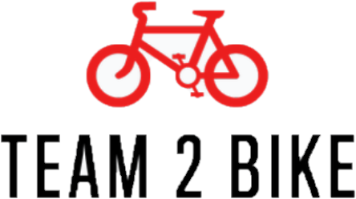

<h1 style="color:red">About us: Team 2 Bike</h1>

Welcome to the repository of Team 2 Bike, the mobile app that offers a bike rental system to all type of people looking to be healthier, more ecofriendly or simply do not want to use the train all the time. We are a young group of four students that came together in the [GXC International Virtual Innovation Challenge](https://www.hm.edu/en/international/projects_1/gxc/gxc_virtual_innovation_challenge.en.html) and had to complete a challenge. 

The **goal of the challenge** has been to create a buisness solution for [Deutsche Bahn](https://www.bahn.de/) on how to offer and communicate the upcoming bike rental feature.

After meeting our team-members, we started with the research and came up with the question: "Why and Who even would want to use a bike rental and how could we make it fit into the existing Deutsche Bahn products?". So we came up with a user story.

## User Story

The detailed process of the User Story can be found [here](https://github.com/gxc-challenge-winter21/gxc-team-2/wiki/Buisness-Side-of-Things#a-potential-userstory).

# Team 2 Bike - The easy solution for bike rental

Team 2 Bike is going to offer the users of Deutsche Bahn a cheap, healthy and ecofriendly alternative for public transportation. With the comfortable option to pay via paypall, users will be able to use the bikes anytime they want. Additionally, Team 2 Bike a sharing option to compare bike usage statistics with his friends on social media.   

**The application will create a new user-base for Deutsche Bahn and reduce its current ecological footprint while remaining fair prices.**

TODO: Add Image of Prototyp

To see the complete prototype, click [here](https://www.google.de).

### [Full Documentation](https://github.com/gxc-challenge-winter21/gxc-team-2/wiki)
